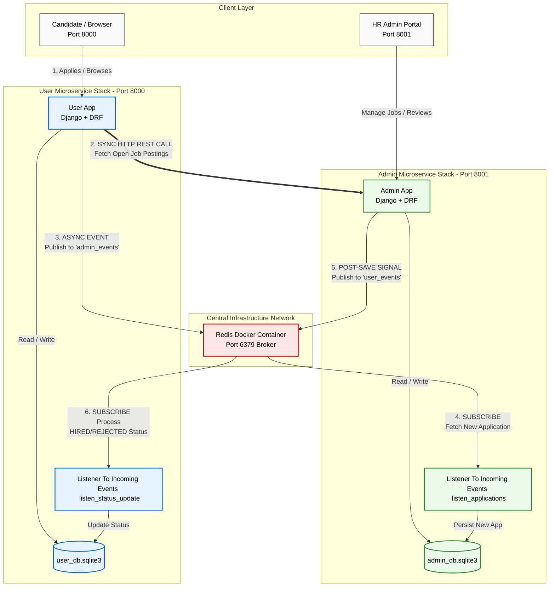

# Job Application Submission and Review Microservice Architecture

## A decoupled microservice architecture built with Django, utilizing Redis Pub/Sub channels asynchronous event streaming.

This project implements a decoupled, distributed microservices architecture modeled after a real-world enterprise Applicant Tracking System (ATS). It isolates candidate operations (**User Service**) from recruiter operations (**Admin Service**) using a strict **Database-per-Service** design pattern. By leveraging a centralized Redis message broker, the platform facilitates fast synchronous REST API communication alongside highly scalable, bi-directional asynchronous event workflows. This setup ensures that high-volume operations—such as heavy job application spikes and real-time recruitment status adjustments—are handled instantly without thread-blocking dependencies, memory leaks, or database cross-contamination.

---

## Project Architecture Layout

The system is split into two completely isolated Django applications and an independent Redis container, communicating via networks mapped out in a `docker-compose.yml` grid:

*   **User Microservice (Port 8000):** Candidate-facing portal tracking profiles and submission states via an isolated local database (`user_db.sqlite3`).
*   **Admin Microservice (Port 8001):** Recruiter-facing dashboard handling vacancies and candidate evaluation boards via an isolated local database (`admin_db.sqlite3`).
*   **Redis Message Broker (Port 6379):** The async engine running Pub/Sub pipelines to bridge data states seamlessly.


---

## How to Install and Run the project

Follow these step-by-step instructions to orchestrate, build, and interact with the complete distributed microservice platform on your machine.

### 1. Prerequisites
Ensure you have **Docker** and **Docker Compose** installed on your Computer. 

### 2. Project Directory Setup
Verify that your directory matches the structural topology below:
```text
microservices_django/
│
├── admin_service/           # Admin Django Application Folder
│   ├── Dockerfile
│   └── ...
├── user_service/            # User Django Application Folder
│   ├── Dockerfile
│   └── ...
└── docker-compose.yml       # Centralized orchestration blueprint
```

### 3. Build and Spin Up the Containers
Open your terminal in the root folder (where `docker-compose.yml` resides) and execute:
```bash
docker-compose up --build
```

### 4. Create Superuser Profiles (For Admin Dashboard Access)
Because the databases are isolated, you must create an admin login credential inside each container separately to test the graphical panels. 

Open a new terminal window and run:
*   **For User Dashboard (Port 8000):**
    ```bash
    docker exec -it user-service python manage.py createsuperuser
    ```
*   **For Admin Dashboard (Port 8001):**
    ```bash
    docker exec -it admin-service python manage.py createsuperuser
    ```

---
